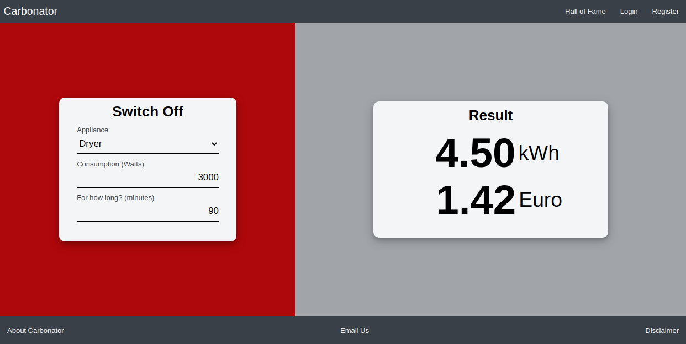

# Save Energy with with Carbonator
A Web App to help reduce your Carbon Footprin and fight Climate Change
---

I wrote this Web App as my Final Project for Web Programming Course offered by Harvard University.

For this project, I decided to develop something that *I* would be interested to use myself. I habitually try not to leave lights unnecessarily on but until I developed this web app, I could not tell you what change a small action like this could achieve in terms of energy saving and more importantly in terms of **money** and **environmental impact**.

The underlying concept of a calculator and keeping a record of actions and their consequences can easily be adapted to many other scenarios, for example optimizing use of scarce resources by large teams in a business environment.

# Carbonator

Carbonator helps you find out how small actions, such as switching off a light bulb or TV all contribute to saving energy.

We all know intuitively that we should use less energy, but it is not always
easy to comprehend, let alone explain to others, the individual and cumulative impact of small behavior changes everyday.

Carbonator helps quantify these impacts, putting them into perspective. Thanks to Carbonator, you can make better informed decisions about the trade-offs we all have to consider 
in our daily lives.

It could also be used as an educational tool by teachers and parents to make abstract concepts of energy use and its monetary and environmental consequences more tangible.

<p align="center"></p>

## Distinctiveness and Complexity:

Carbonator combines an online calculator with the ability to store compare users' achievements, adding a competitive element.

All visitors are free to play around with the calculator and see how much energy they could save by switching off a light bulb for 30 minutes for example.

If they register, they can "bank" a saving which presents them instantly with a congratulatory message with a random dimension: 

<p align="center"></p>

Since the scale of savings can vary significantly, the message is constructed using some random elements to keep it meaningful and reduce repetition.

When they click on their username they are taken to Profile page where they can see the total energy they saved and where they stand compared to other users. This page also gives them the possibility to delete incorrect savings. There is an undo function before any saving is permanently deleted.

The app is written in Python -  Django - and Javascript, similar to previous CS50W projects. However, I have used the following technologies extensively for the first time, during the course of developing this project:

- **Git branching and merge** for developing various features, whilst keeping the main app intact

- **Postgres** for back end database rather than default mysql which comes with Django

- **Django tests** for various routes  **Selenium tests** for some pages

- **Github Actions** testing each commit to the master and other branches as needed

- The app is completely containerized using **Docker**. It consists of 2 containers running alongside, one for the website and the other one for the database. Data is saved on a persistent volume which is normally preserved between sessions unless destroyed intentionally

- I also used **CSRF token for fetch PUT and DELETE scripts** which means I did not have to use "CSRF exempt" in the relevant Django routes

- The app is completely responsive thanks to a **media query** converting links on the banner to a hamburger-style menu for smaller screens. All other content scales down in a responsive style thanks to heavy use of **flexbox** in CSS

- I intentionally **avoided using Bootstrap** or similar templates as a challenge to myself, to get better with CSS concepts such as flexbox

## How to run the app:

The instructions here are based on an Ubuntu 20.04 LTS installation with docker and docker-compose installed. Even though it works without problems stand-alone, it is is much simpler to run the app using docker containers therefore this is the recommended method.

After running the command `docker-compose up -d` in capstone directory will install django, python and all other dependencies in 2 docker docker containers, and even populate the database with some dummy data to play around with.

In order to access the app, please visit `http://0.0.0.0:8000` in a browser on the host computer, or indeed from anywhere else on the local network using the ip address of the host computer and port 8000.

"Email Us" link on the footer triggers the host device to compose an email to a fictional address carbonator@carbonator.com.

The containers and the app can be stopped using `docker-compose down`.

User data saved within the app is persistent in a separate docker volume.

In order to back-up all user and appliance data please issue the following command

```docker exec -e PGPASSWORD="carbonator" postgres_image pg_dump -U carbonator -F p carbonator -h localhost > ./docker/postgres/carbonator.sql```

In order to restore from backup first destroy the data volume by adding `--volumes` at the end of `docker-compose down` command.

Then issue the following command to force Docker to rebuild the postgres container using the carbonator.sql file.

```docker build --no-cache --force-rm -t postgres:latest ./docker/postgres```

Next time you start the application with docker-compose up it should contain the data from back up.


## requirements.txt File

This file is in /docker/website subfolder because it is used by the website container dockerfile. If you choose to build the app without docker containers directly from capstone directory, the dependencies can be installed with `pip3 install -r ./docker/website/requirements.txt` provided that Python 3 is already installed on host computer.

## Security:

This is a development build and therefore does not contain all security features which would be needed for using it in production. For adding/removing users, appliances etc. it is possible to use Django Admin interface with the following credentials.

> 
> django admin username:    superduper

> django admin password:    magnificient

Postgres credentials if needed:

> postgres database:        carbonator

> username:                 carbonator

> password:                 carbonator


<p align="center"><a href="http://www.youtube.com/watch?feature=player_embedded&v=vMx8dcKjyPI" target="_blank"></a></p>

## List of files and their contents:

### CI/CD GitHub 

* **carbonator/tests.py**

    Django and Selenium tests


* **.github/workflows/carbonator_tests master.yml:**

    Builds and run tests on the app first on a virtual machine without docker and then inside docker containers.

### Docker Files

* **docker-compose.yml**

    Builds the containers and runs the app.

* **docker-compose-test.yml**

    Use with this command to run the tests within containers `docker-compose -f docker-compose-test.yml up --abort-on-container-exit`.


* **docker-compose-ci.yml**

    Used by github actions to run tests on the master branch.


* **Website Container**

    * **docker/website/Dockerfile**

        Builds docker image for django website container


    * **docker/website/requirements.txt**

        Python requirements file to run the application

* **Postgres Database Container**

    * **docker/postgres/Dockerfile**

        Builds docker image for Postgres database.

    * **docker/postgres/carbonator.sql**

        Backup file which populates the Postgres database when it is created. Initially contains dummy data for about 12 users to view full functionality of the app. It can be overwritten with the backup command explained in "How to run the app" section.


### Django models:

* **carbonator/models.py:**

    - User: Self explanatory
    - Appliance: names and typical consumption and usage data for various appliances
    - Saving: To store savings for registered users
    - Cost: For users who choose their own monetary and environmental cost coefficients


### HTML Templates

* **carbonator/templates/carbonator/index.html:**

    Main landing page. Calculates energy saving impact based on criteria given on a form. Allows to "bank" savings for registered users.


* **carbonator/templates/carbonator/profile.html:**

    Page to display savings achieved by logged in users.


* **carbonator/templates/carbonator/halloffame.html:**

    Shows a list of 10 registered users with the largest amount "banked" energy savings.


* **carbonator/templates/carbonator/settings.html:**

    Allows users to change some variables such as money units and cost of electricity.


* **carbonator/templates/carbonator/disclaimer.html:**

    Recommends to take values as a guidance and use own assumptions where applicable.


* **carbonator/templates/carbonator/register.html:**

    Register new users.


* **carbonator/templates/carbonator/login.html:**

    Login existing users.


* **carbonator/templates/carbonator/about.html:**

    High level overview and purpose of the app.


* **carbonator/templates/carbonator/layout.html:**

    Used for common formatting such as header and footer across all pages.

### Javascript Files

* **carbonator/static/carbonator/layout.js**

    Resizes the banner links to a hamburger-style menu for smaller screens.

* **carbonator/static/carbonator/index.js**

    Populates selection list for appliances. Recalculates energy use after each selection or change to inputs such as duration. It also populates the confirmation message after each bank action. Includes a CSRF token generator.

* **carbonator/static/carbonator/profile.js**

    Lists each saving the current user has banked. Endless-scroll when the number of savings exceed screen height. Adds delete button which activates an animation when clicked. Confirmation message and undo link.

* **carbonator/static/carbonator/settings.js**

    Adds functionality to "Reset" button to restore default values.


### CSS Files

* **carbonator/static/carbonator/layout.css**
* **carbonator/static/carbonator/styles.css**

    These provide styling for all pages. `layout.css` which contains styling for the footer, banner and the main background is kept separate in order not to clutter `styles.css` unnecessarily.


### Miscellaneous

* **.gitignore**

    List of files to be ignored by GitHub. Includes some generic Django files and my own sketchpad files which are not necessary for the application.

* **images/carbonator_main.png**
* **images/carbonator_motivator.png**

    Images for embedding into this readme document.


