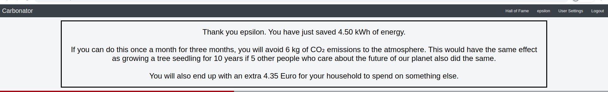

# CS50 W Final Project - Capstone
---
# Carbonator

Carbonator is a web app designed to help you combat climate change by reducing your own carbon footprint.

It helps you find out how small actions, such as switching off a light bulb or tv all contribute to saving energy.

We all know intuitively that we should use less energy but it is not always
easy to comprehend, let alone explain to others, the individual and cumulative impact of each small action.

Carbonator helps quantify these impacts, putting them in perspective. That means using Carbonator, you can make better informed decisions about the trade-offs we all have to consider 
in our daily lives.

It could also be used as an educational tool by teachers and parents.


## Distinctiveness and Complexity:

Carbonator combines an online calculator with the ability to store compare users' achievements, adding a competitive element.

All visitors are free to play around with the calculator and see how much energy they could save by switching off a light bulb for 30 minutes for example.

If they register, they can "bank" a saving which presents them instantly with a congratulatory message with a random dimension: 



Since the scale of savings can vary significantly, the message is constructed using some random elements to keep it meaningful and reduce repetition.

When they click on their username they are taken to Profile page where they can see the total energy they saved and where they stand compared to other users. This page also gives them the possibility to delete incorrect savings. There is an undo function before any saving is permanently deleted.

The app is written in Django and Javascript as similar to previous projects. However, I have used the following technologies extensively for the first time, during the course of developing this project:

- **Git branching and merge** for developing various features, whilst keeping the main app intact
- **Postgres** for back end database: Migrated from mysql
- Testing: **Django Tests and Selenium**
- **Github Actions**: For testing each commit to the master and other branches as needed
- **Docker**: The app runs fully in 2 docker containers, one for the website and one for the database. Data is saved on a persistent volume which is normally preserved between sessions unless destroyed intentionally.
- **CSRF token for fetch scripts** which means I did not have to use "CSRF exempt" in Django routes
## List of files and their contents:

### Docker Compose files
#### docker-compose.yml
Main docker-compose file used for running the app in docker containers.

#### docker-compose-test.yml
Used for running unit and selenium tests within docker containers

#### docker-compose-ci.yml
Used by github actions to run tests on the master branch.

### CI/CD GitHub 
#### .github/workflows/carbonator_tests master.yml:
Github actions to test each commit on master. Builds and tests 2 versions; one using docker, and one github virtual machine without docker. 

### Django Files

#### carbonator/views.py:
All routes to render pages and respond to fetch queries used by django.

#### HTML Templates
##### carbonator/templates/carbonator/profile.html:
Page to display savings achieved by logged in users.

##### carbonator/templates/carbonator/index.html:
Main landing page. Calculates energy saving impact based on criteria given on a form. Allows to "bank" savings for registered users.

##### carbonator/templates/carbonator/disclaimer.html:
Short explanation of calculation rationale.

##### carbonator/templates/carbonator/layout.html:
Used for common formatting such as header and footer across all pages.

##### carbonator/templates/carbonator/register.html:
Register new users.

##### carbonator/templates/carbonator/login.html:
Login existing users.

##### carbonator/templates/carbonator/settings.html:
Allows users to change some variables such as money units and cost of electricity.

##### carbonator/templates/carbonator/about.html:
High level overview and purpose of the app.

##### carbonator/templates/carbonator/halloffame.html:
Shows a list of 10 registered users with the largest amount "banked" energy savings.

#### Django Models
##### carbonator/models.py:
Defines 4 models used by django for the application.
- User: Self explanatory
- Appliance: names and typical consumption and usage data for various appliances
- Saving: To store savings for registered users
- Cost: For users who choose their own monetary and environmental cost coefficients

#### Javascript Files
These carry out 

##### carbonator/static/carbonator/halloffame.js

##### carbonator/static/carbonator/layout.js

carbonator/static/carbonator/settings.js
carbonator/static/carbonator/layout.css
carbonator/static/carbonator/profile.js
carbonator/static/carbonator/index.js
carbonator/static/carbonator/styles.css
carbonator/tests.py
.gitignore
docker/website/requirements.txt
docker/website/Dockerfile
docker/postgres/carbonator.sql
docker/postgres/Dockerfile


requirements.txt

## How to run Carbonator:

```pg_dump -U carbonator -W -F p carbonator -h localhost > ./docker/postgres/carbonator.sql```


## Other information:


- Undo functionality - Decided against 'confirm'
